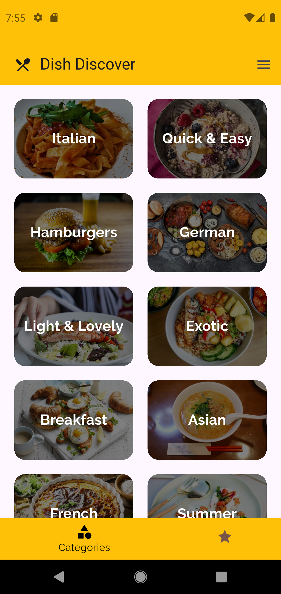
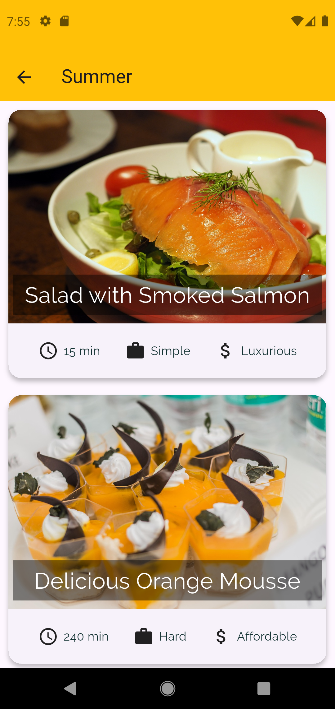
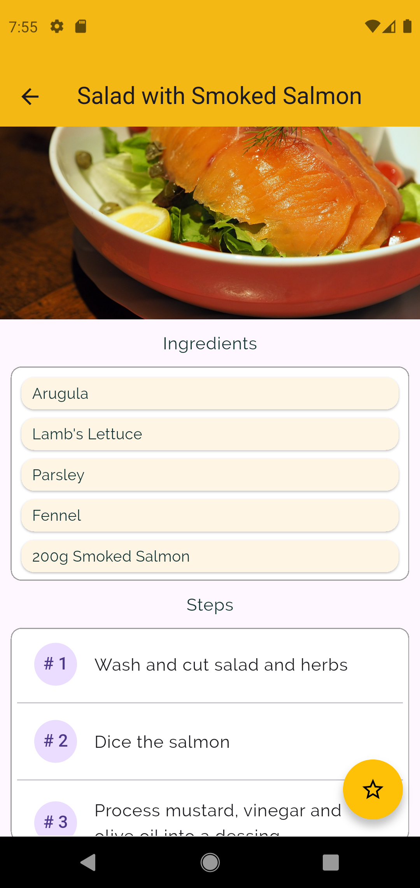
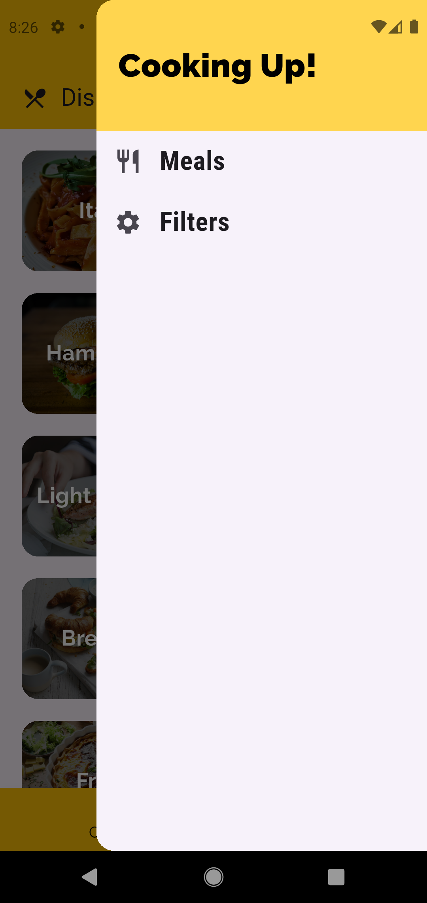
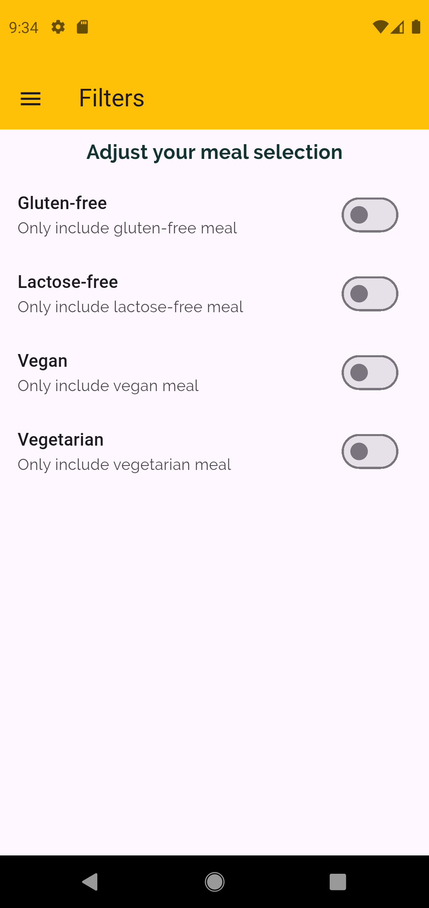
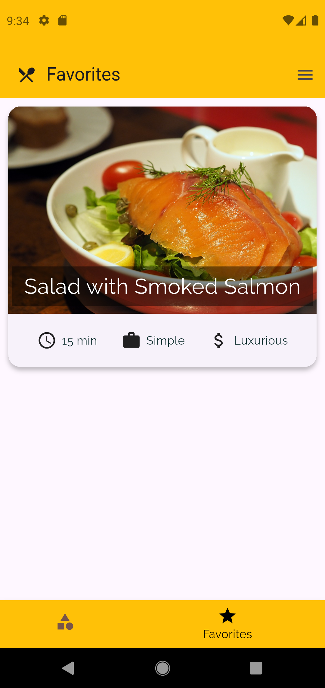

# Dish Discover

**Dish Discover** is a simple, clean, and responsive Flutter application designed to help users explore diverse culinary recipes, filter meals based on dietary preferences, and save their favorite dishes for quick access.

---

## Features

- **Browse Categories:** Explore various global cuisines and meal styles (Italian, German, Asian, Summer, etc.).
- **Detailed Meal Insights:** View cooking preparation time, complexity levels (Simple, Hard), and affordability (Affordable, Luxurious).
- **Recipe Steps & Ingredients:** Clear ingredient breakdowns and step-by-step cooking guides.
- **Smart Filtering:** Toggle options to filter recipes by dietary restrictions:
  - Gluten-free
  - Lactose-free
  - Vegan
  - Vegetarian
- **Favorites Management:** Easily bookmark recipes using the star floating button and manage them in a **dedicated** favorites tab.
- **Smooth Navigation:** Features both a bottom navigation bar and a side drawer menu for seamless user experience.

---

## Screenshots

|             Categories Screen              |                 Category Meals                  |                 Recipe Details                 |
| :----------------------------------------: | :---------------------------------------------: | :--------------------------------------------: |
|  |  |  |

|            Side Navigation Drawer             |                  Dietary Filters                  |                     Favorites Tab                     |
| :-------------------------------------------: | :-----------------------------------------------: | :---------------------------------------------------: |
|  |  |  |

---

## Tech Stack

- **Framework:** [Flutter](https://flutter.dev/)
- **Language:** [Dart](https://dart.dev/)
- **State Management:** Flutter Riverpod

---

## Getting Started

Follow these steps to get a local copy of the project up and running.

### Prerequisites

Make sure you have the Flutter SDK installed on your machine. For setup instructions, visit the official [Flutter installation guide](https://docs.flutter.dev/get-started/install).

### Installation

1. **Clone the repository:**
   ```bash
   git clone https://github.com/emmaephrim/DishDiscover.git
   cd DishDiscover
   flutter pub get
   flutter run
   ```

---
